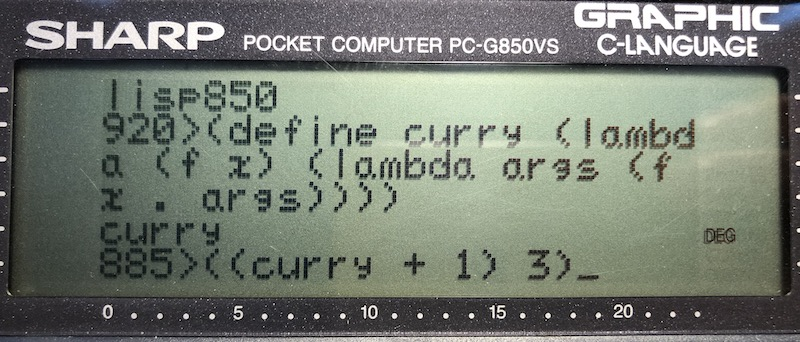

# Lisp in 99 lines of C and how to write one yourself

In honor of the contributions made by Church and McCarthy, I wrote this project and the accompanying article to show how anyone can write a tiny Lisp interpreter in a few lines of C or in any "C-like" programming language for that matter.  I attempted to preserve the original meaning and flavor of Lisp as much as possible.  As a result, the C code in this project is strongly Lisp-like in compact form.  Despite being small, these tiny Lisp interpreters in C include 20 built-in Lisp primitives, garbage collection and REPL, which makes them a bit more practical than a toy example.  If desired, more Lisp features can be easily added with a few more lines of C as explained in the accompanying article with examples that are ready for you to try.

## Tinylisp running on a vintage Sharp PC-G850VS pocket computer

A cool pocket computer with a built-in C compiler.  Tinylisp compiles and runs on this machine too with its native C!

## How is tinylisp so small?

Using NaN boxing and BCD boxing (for BCD floating point) and some programming tricks in C.  See my [article](tinylisp.pdf) for details and examples.

## Project code

- [tinylisp.c](src/tinylisp.c) Lisp in 99 lines of C
- [tinylisp-opt.c](src/tinylisp-opt.c) optimized version for speed and reduced memory use
- [lisp850.c](src/lisp850.c) Lisp in 99 lines of C for the Sharp PC-G850 with BCD boxing
- [lisp850-opt.c](src/lisp850-opt.c) optimized version for speed and reduced memory use
- [common.lisp](src/common.lisp) common Lisp functions defined in tiny Lisp itself
- [list.lisp](src/list.lisp) list functions library
- [math.lisp](src/math.lisp) some Lisp math functions

To compile tinylisp:
~~~
$ cc -o tinylisp tinylisp-opt.c
~~~
To install the libraries when running tinylisp, use Linux/Unix `cat`:
~~~
cat common.lisp list.lisp math.lisp | ./tinylisp
~~~
But before you can do this, you will have to change the `look` function as explained in Section 7 of the article.

On the Sharp PC-850 use SIO or [PocketTools](https://www.peil-partner.de/ifhe.de/sharp/) to load via audio cassette interface (CE-124 or CE-126p):
~~~
PC: bas2img --pc=G850VS --type=asm -l0x408 lisp850-opt.c
PC: bin2wav --pc=G850VS lisp850-opt.img
G850: BASIC (PRO MODE)
G850: BLOAD
PC: play lisp850-opt.wav
G850: TEXT
G850: Basic
G850: Text<-Basic
G850: BASIC (2x PRO MODE)
G850: NEW
G850: 2ndF TEXT (C)
G840: G (go)
~~~
The `bas2img` option `-l0x400` adds line numbers to the C source automatically.
