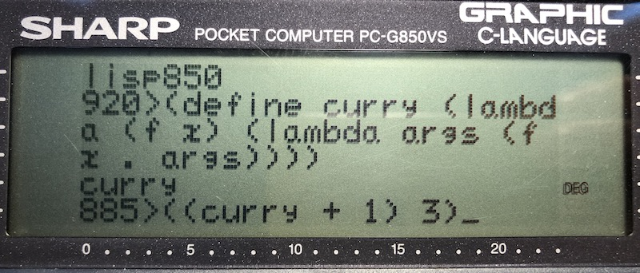
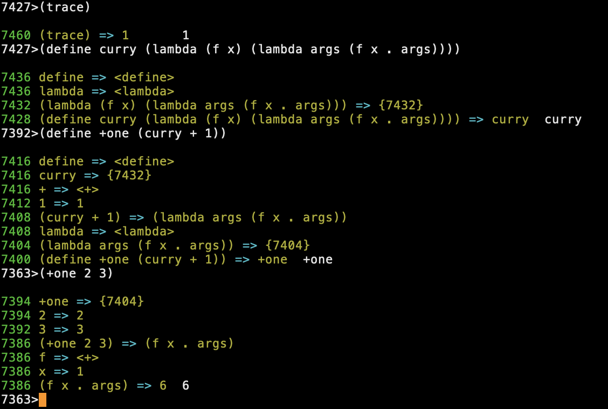

# Lisp in 99 lines of C and how to write one yourself

In honor of the contributions made by Church and McCarthy, I wrote this project and the accompanying [article](tinylisp.pdf) to show how anyone can write a tiny Lisp interpreter in a few lines of C or in any "C-like" programming language for that matter.  I attempted to preserve the original meaning and flavor of Lisp as much as possible.  As a result, the C code in this project is strongly Lisp-like in compact form.  Despite being small, these tiny Lisp interpreters in C include 21 built-in Lisp primitives, simple garbage collection and REPL, which makes them a bit more practical than a toy example.  If desired, more Lisp features can be easily added with a few more lines of C as explained in my [article](tinylisp.pdf) with examples that are ready for you to try.

## Tinylisp running on a vintage Sharp PC-G850VS pocket computer

A cool pocket computer with a built-in C compiler.  Tinylisp compiles and runs on this machine too with its native C!

## How is tinylisp so small?

Using NaN boxing (or BCD boxing) and some programming tricks in C.  See my [article](tinylisp.pdf) for details, examples and detailed instructions how to extend tinylisp with more features.

## Project code

Lisp in 99 lines is written in a Lisp-like functional style of structured C, lines are 55 columns wide on average and never wider than 120 columns for convenient editing.  It supports static scoping, double precision floating point, has 21 built-in Lisp primitives, a REPL and a simple garbage collector.  Tail-call optimized versions are included for speed and reduced memory use.

- [tinylisp.c](src/tinylisp.c) Lisp in 99 lines of C with double precision
- [tinylisp-commented.c](src/tinylisp-commented.c) commented version in an (overly) verbose C style
- [tinylisp-opt.c](src/tinylisp-opt.c) optimized version for speed and reduced memory use
- [tinylisp-float.c](src/tinylisp-float.c) Lisp in 99 lines of C with single precision
- [tinylisp-float-opt.c](src/tinylisp-float-opt.c) optimized version with single precision
- [lisp850.c](src/lisp850.c) Lisp in 99 lines of C for the Sharp PC-G850 with BCD boxing
- [lisp850-opt.c](src/lisp850-opt.c) optimized version for speed and reduced memory use
- [common.lisp](src/common.lisp) common Lisp functions defined in tiny Lisp itself
- [list.lisp](src/list.lisp) list functions library, requires common.lisp definitions
- [math.lisp](src/math.lisp) some Lisp math functions

TL;DR: the article's additions and optimizations fully implemented with comments, including section references:

- [tinylisp-extras.c](src/tinylisp-extras.c) compile with `-lreadline`

The extras version adds 16 Lisp primitives for Lisp source loading, readline, input and output Lisp expressions, exceptions, CTRL-C break, macros, backquoting, and execution tracing as shown below:

To compile tinylisp:

    $ cc -o tinylisp tinylisp-opt.c

The number of cells allocated is N=1024 by default, which is only 8K of memory.  To increase memory size, increase the value of N in the code.  Then recompile tinylisp.

To install one or more optional Lisp libraries to run tinylisp, use Linux/Unix `cat`:

    $ cat common.lisp list.lisp math.lisp | ./tinylisp

But before you can do this, change the `look` function to reopen /dev/tty as explained in Section 7 of the [article](tinylisp.pdf).

## Lisp on a vintage Sharp PC-G850

On the Sharp PC-G850(V)(S) use SIO or [PocketTools](https://www.peil-partner.de/ifhe.de/sharp/) to load via audio cassette interface (CE-124 or CE-126p):

    PC:   bas2img --pc=G850VS --type=asm -l0x408 lisp850-opt.c
    PC:   bin2wav --pc=G850VS lisp850-opt.img
    G850: BASIC (PRO MODE)
    G850: BLOAD
    PC:   play lisp850-opt.wav
    G850: TEXT
    G850: Basic
    G850: Text<-Basic
    G850: BASIC (2x PRO MODE)
    G850: NEW
    G850: 2ndF TEXT (C)
    G840: G (go)

The `bas2img` option `-l0x400` adds line numbers to the C source automatically.

## 99-Liner Lisp language features

### Numbers

Double precision floating point numbers, including `inf`, `-inf` and `nan` (`nan` is the same as `ERR`).  Numbers may also be entered in hexadecimal `0xh...h` format.

### Symbols

Lisp symbols consist of a sequence of non-space characters, excluding `(`, `)` and quotes.  When used in a Lisp expression, a symbol is looked-up for its value, like a variable typically refers to its value.  Symbols can be '-quoted like `'foo` to use symbols literally and to pass them to functions.

### Booleans

Well, Lisp doesn't need Booleans.  An `()` empty list (called nil) is considered false and anything not `()` is considered true.  For convenience, `#t` is a symbol representing true (`#t` evaluates to itself, i.e. quoting is not needed.)

### Lists

Lists are code and data in Lisp.  Syntactically, a dot may be used for the last list element to construct a pair rather than a list.  For example, `'(1 . 2)` is a pair, whereas `'(1 2)` is a list.  By the nature of linked lists, a list after a dot creates a list, not a pair.  For example, `'(1 . (2 . ()))` is the same as `'(1 2)`.  Note that lists form a chain of pairs ending in a `()` nil.  

### Function calls

    (<function> <expr1> <expr2> ... <exprn>)

applies a function to the rest of the list of expresssions as its arguments.  The following are all built-in functions, called "primitives" and "special forms".

### Quoting and unquoting

    '<expr>
    (quote <expr>)

protects `<expr>` from evaluation by quoting, same as `'<expr>`.  For example, `'(1 () foo (bar 7))` is a list containing unevaluated expressions protected by the quote.

    (eval <quoted-expr>)

evaluates a quoted expression and returns its value.  For example, `(eval '(+ 1 2))` is 3.

### Constructing and deconstructing pairs and lists

    (cons x y)

constructs a pair `(x . y)` for expressions `x` and `y`.  Lists are formed by chaining sevaral cons pairs, with the empty list `()` as the last `y`.  For example, `(cons 1 (cons 2 ()))` is the same as `'(1 2)`.

    (car <pair>)

returns the first part `x` of a pair `(x . y)` or list.

    (cdr <pair>)

returns the second part `y` of a pair `(x . y)`.  For lists this returns the rest of the list after the first item.

    (pair? x)

returns `#t` (true) if `x` is a pair, that is, a non-empty list cons-cell to which `car` and `cdr` can be applied.

### Arithmetic

    (+ n1 n2 ... nk)
    (- n1 n2 ... nk)
    (* n1 n2 ... nk)
    (/ n1 n2 ... nk)

add, substract, multiply or divide `n1` to `nk`.  This computes `n1` oper `n2` oper ... oper `nk`. Note that `(- 2)` is 2, not -2, and note that `(- 0 2)` gives -2.  Also, at least one value `n` should be provided.  As the article suggests, change the Lisp interpreter as you like to change this.

    (int n)

returns the integer part of a number `n`.

### Logic

    (< n1 n2)

returns `#t` (true) if numbers `n1` < `n2`.  Otherwise, returns `()` (empty list means false).

    (eq? x y)

returns `#t` (true) if values `x` and `y` are identical.  Otherwise, returns `()` (empty list means false).  Numbers and symbols of the same value are always identical, but non-empty lists may or may not be identical even when their values are the same.

    (or x1 x2 ... xk)

returns the value of the first `x` that is not `()`.  Otherwise, returns `()` (empty list means false).  Only evaluates the `x` until the first is not `()`, i.e. the `or` is conditional.

    (and x1 x2 ... xk)

returns the value of the last `x` if all `x` are not `()`.  Otherwise, returns `()` (empty list means false).  Only evaluates the `x` until the first is `()`, i.e. the `and` is conditional.

    (not x)

returns `#t` if `x` is not `()`.  Otherwise, returns `()` (empty list means false).

### Conditionals

    (cond (x1 y1) (x2 y2) ... (xk yk))

returns the value of `y` corresponding to the first `x` that is not `()` (meaning not false, i.e. true.)

    (if x y z)

if `x` is not `()` (meaning not false, i.e. true), then return `y` else return `z`.

### Lambdas

    (lambda <variables> <expr>)

returns an anonymous function "closure" with a list of variables and an expression as its body.  For example, `(lambda (n) (* n n))` squares its argument.  The variables of a lambda may be a single name (not placed in a list) to pass all arguments as a named list.  For example, `(lambda args args)` returns its arguments as a list.  The pair dot may be used to indicate the rest of the arguments.  For example, `(lambda (f x . args) (f . args))` applies a function argument`f` to the arguments `args`, while ignoring `x`.  The closure includes the lexical scope of the lambda, i.e. local names defined in the outer scope can be used in the body.  For example, `(lambda (f x) (lambda args (f x . args)))` is a function that takes function `f` and argument `x` to return a [curried function](https://en.wikipedia.org/wiki/Currying).

### Globals

    (define <symbol> <expr>)

globally defines a symbol associated with the value of an expression.  If the expression is a function or a macro, then this globally defines the function or macro.

### Locals

Locals are declared with the following `let*` special form.  This form differs slightly in syntax from other Lisp and Scheme implementations, with the aim to make let-forms more intuitive to use (but you can change it in the Lisp interpreter if you like):

    (let* (v1 x1) (v2 x2) ... (vk xk) y)

evaluates `y` with a local scope of bindings for symbols `v` subsequently bound from the first to the last to the corresponding values of `x`.

> Note that most Lisp use a syntax with binding pairs in a list and one or more body expressions:
> 
>     (let* ((v1 x1) (v2 x2) ... (vk xk)) y1 ... yn)
> 
> In tinylisp we can do the same by binding all but the last body expression `y` to dummy variables:
> 
>     (let* (v1 x1) (v2 x2) ... (vk xk) (_ y1) ...) yn)

## Additional Lisp primitives introduced in the [article](tinylisp.pdf)

    (assoc <quoted-symbol> <environment>)

returns the value associated with the quoted symbol in the given environment.

    (env)

returns the current environment.  When executed in the REPL, returns the global environment.

    (let (v1 x1) (v2 x2) ... (vk xk) y)

evaluates `y` with a local scope of bindings for symbols `v` bound to the values of `x` evaluated in the outer scope.

    (letrec* (v1 x1) (v2 x2) ... (vk xk) y)

evaluates `y` with a local scope of bindings for symbols `v` subsequently bound from the first to the last to the values of `x`, supporting self-recursive lambda closures.

    (letrec (v1 x1) (v2 x2) ... (vk xk) y)

evaluates `y` with a local scope of bindings for symbols `v` bound to the values of `x` evaluated in the local scope, supporting mutual-callable and mutual-recursive lambda closures.

    (setq <symbol> x)

destructively assigns a globally or locally-bound symbol a new value.

    (set-car! <pair> x)
    (set-cdr! <pair> y)

destructively assigns a pair a new car or cdr value, respectively.

    (macro <variables> <expr>)

a macro is like a function, except that it does not evaluate its arguments.  Macros typically construct Lisp code that is evaluated when the macro is expanded.  For example, `(define defun (macro (f v x) (list 'define f (list 'lambda v x))))` defines a `defun` shortcut: `(defun <symbol> <variables> <expr>)` expands to `(define <symbol> (lambda <variables> <expr>))`.  The `defun` macro uses `(define list (lambda args args))` to create lists of Lisp code.

    `<expr>

backquotes `<expr>`, which quotes `<expr>`, but evaluates all `,<expr>` subexpressions therein before quoting.  For example, the macro example above can also be written as ``(define defun (macro (f v x) `(define ,f (lambda ,v ,x))))`` without using `list` to construct lists and "down quotes" to replace variables with their values.

    (read)

returns the Lisp expression read from input.

    (print x1 x2 ... xk)
    (println x1 x2 ... xk)

prints the expressions.

    (trace <0|1|2|3>)

disables tracing (0), enables tracing (1), tracing with ENTER key press (2), and with memory dumping (3).

    (catch <expr>)

catch exceptions in the evaluation of an expression, returns the value of the expression or `(ERR . n)` for nonzero error code `n`.

    (throw n)

throws error `n`, where `n` is a nonzero integer.

    (load <atom>)

parses and executes Lisp from a file with the name `<atom>`, for example `(load some.lisp)` (name is not quoted).

## Additional Lisp functions defined in tinylisp itself

The following functions are defined in [common.lisp](src/common.lisp).

    (null? x)

same as `not`, returns `#t` if `x` is not `()`.  Otherwise, returns `()` (empty list means false).

    (err? x)

evaluates `x` and returns `#t` if `x` is an `ERR` value.  Otherwise, returns `()`.

    (number? n)

returns `#t` if `n` is numeric.  Otherwise, returns `()`.

    (symbol? a)

returns `#t` if `a` is a symbol, for example `(symbol? 'foo)` is `#t`.  Otherwise, returns `()`.

    (atom? a)

returns `#t` if `a` is an atom, that is, a symbol or the empty list `()`.  Otherwise, returns `()`.

    (list? <list>)

returns `#t` if `<list>` is a proper list, i.e. either empty `()` or a list of values.  Otherwise, returns `()`.

    (equal? x y)

returns `#t` if `x` and `y` are structurally equal.  Otherwise, returns `()`.

    (negate n)

returns the negative of `n`.

    (> n1 n2)

returns `#t` if numbers `n1` > `n2`.  Otherwise, returns `()`.

    (<= n1 n2)

returns `#t` if numbers `n1` <= `n2`.  Otherwise, returns `()`.

    (>= n1 n2)

returns `#t` if numbers `n1` >= `n2`.  Otherwise, returns `()`.

    (= n1 n2)

returns `#t` if numbers `n1` = `n2`.  Otherwise, returns `()`.

    (list x1 x2 ... xk)

returns the list of `x1`, `x2`, ..., `xk`.  That is, `(x1 x2 ... xk)` with all `x` evaluated.

    (cadr <list>)

returns `(car (cdr <list>))`.  That is, the second value of `<list>`.

    (caddr <list>)

returns `(car (cdr (cdr <list>)))`.  That is, the third value of `<list>`.

    (begin x1 x2 ... xk)

evaluates all `x` and returns the value of `xk`.

## There is more: two sequels to tinylisp

In addition to tinylisp, I've written two other small classic Lisp implementations that share similarities with tinylisp, but expanded to include over 40 built-in Lisp primitives, strings, macros, exceptions, execution tracing, file loading, and a REPL:

- [Lisp in 1k lines of C with garbage collector, explained](https://github.com/Robert-van-Engelen/lisp) uses mark-sweep/compacting garbage collection.  Unlike tinylisp however, a separate pool of free cons pair cells is used to construct lists.  The garbage collector frees up space in the pool using mark-sweep.  Space is freed up in the atom/string heap by compacting the heap after mark-sweep using pointer reversal.

- [Lisp in 1k lines of C with Cheney's copying garbage collector, explained](https://github.com/Robert-van-Engelen/lisp-cheney) uses Cheney's copying garbage collector.  Like tinylisp, a stack is used to efficiently construct lists, i.e. by pushing two cells at a time on the stack to allocate cons pairs.  Heap allocation simply pushes atom/string space up from the bottom of the heap (towards the stack).  The garbage collector frees up stack and heap space by copying the active cons pair cells, atoms and strings to a new stack/heap.
